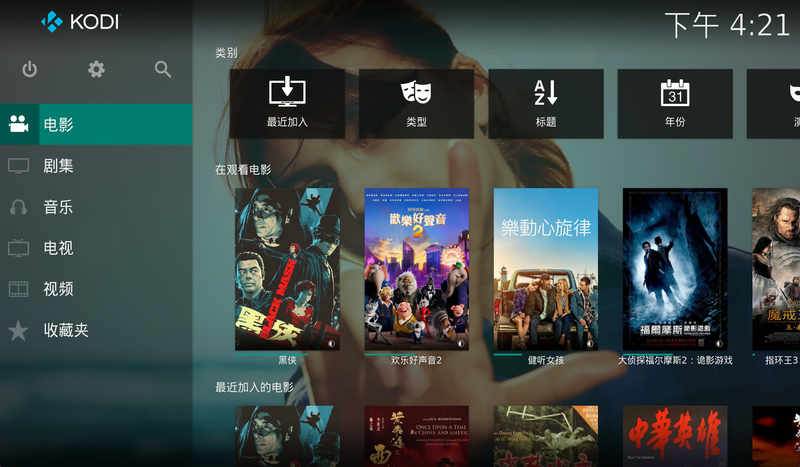
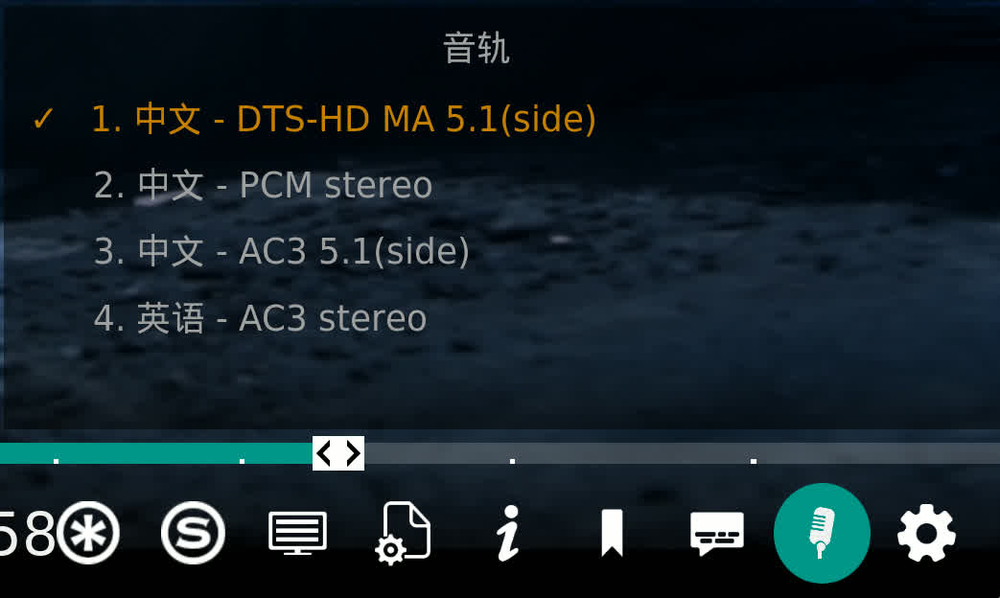

# Skin CPM Estuary Search

本皮肤基于 CPM 的 Estuary Mod 进行修改，主要包含以下改进和调整：

## 依赖说明

皮肤的筛选页面绑定和OSD菜单音轨和字幕的弹窗依赖于 **Filtered Movies** 插件，请确保安装：
*   [plugin.video.filteredmovies](https://github.com/forbxy/plugin.video.filteredmovies)

## 功能特性

1.  **快捷筛选**
    *   绑定放大镜按钮，点击直接打开筛选页面。

2.  **视觉优化**
    *   将皮肤整体调整为半透明化效果，提升视觉通透感。
    *   海报墙视图添加电影或剧集名称显示。

3.  **OSD 播放菜单增强**
    *   新增独立的音轨按钮。
    *   **智能弹窗**：当音轨按钮或字幕按钮被聚焦时，自动弹出视图供快速选择字幕或音轨。
    *   界面调整：将 VS10 按钮与其他按钮对齐，保持界面整洁。

4.  **中文支持**
    *   修改默认字体为 Arial，有效防止中文乱码问题。

## 预览

