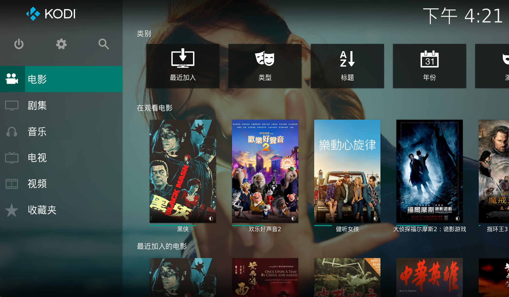
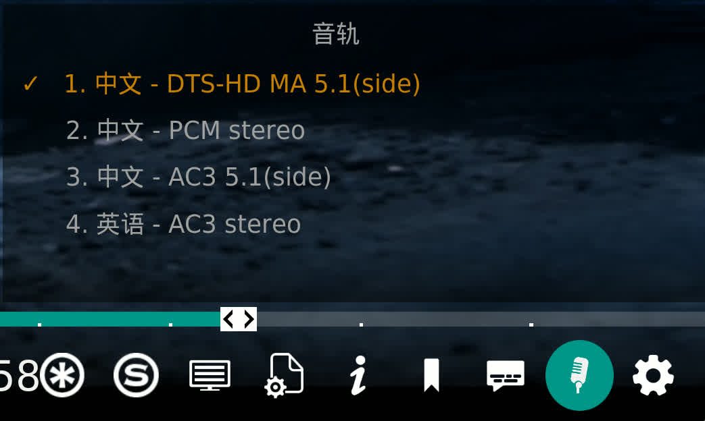

# Skin CPM Estuary Search

基于 [CPM Estuary Mod](https://github.com/cpm-code/cpm.Estuary) 修改的 Kodi 皮肤（原版 Estuary 作者 phil65）。

## 安装

1. 安装 [forbxy 仓库](https://github.com/forbxy/repository.forbxy)
2. Kodi → **设置 → 插件 → 从库安装 → forbxy Add-on repository → 界面外观 → 皮肤** → 安装 **cpm.EstuarySearch**

## 改动

- **快捷筛选**：放大镜按钮一键打开筛选页面
- **半透明界面**：整体视觉通透化
- **海报墙标题**：海报墙视图显示影片名称
- **OSD 增强**：独立音轨按钮、聚焦自动弹窗选择音轨/字幕、VS10 按钮对齐
- **中文字体**：默认字体改为 Arial，防止中文乱码
- **播放器信息页中文翻译**：DV/HDR 页面全部中文本地化（新增 25 条翻译）、尼特列右对齐、AML 硬解 FPS 布局优化、修复 RPU/BL/EL 指示符编码问题

## 预览

